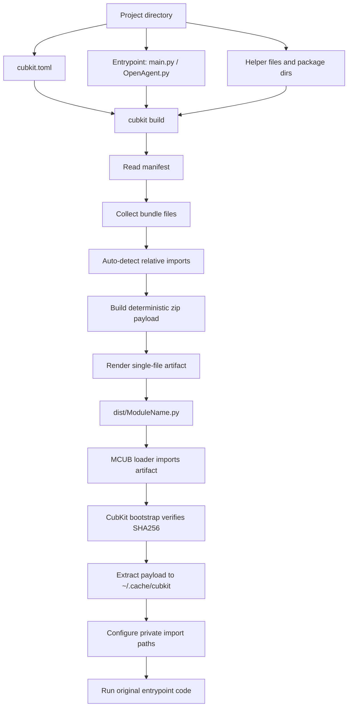

# CubKit documentation

CubKit packs a multi-file MCUB module project into one MCUB-loadable `.py`
artifact. You write normal source files, CubKit embeds helper files into the
generated artifact, and the generated bootstrap extracts them into a private cache
at import time.

## Full build flow



## Minimal project

```text
my_module/
  cubkit.toml
  main.py
  utils.py
```

`cubkit.toml` can be tiny:

```toml
id = "my_module"
entrypoint = "main.py"
```

Optional metadata:

```toml
name = "MyModule"
version = "dev"
author = "@username"
description = "Example MCUB module"
requires = ["aiohttp"]
scop = "inline"
sign = true
```

## What to write in the main file

### Class-style module

Use class-style for most MCUB modules:

```python
from __future__ import annotations

import core.lib.loader.module_base as loader

from .utils import echo_text


class MyModule(loader.ModuleBase):
    name = "MyModule"
    version = "1.0.0"
    author = "@username"
    description = "Small CubKit example"

    @loader.command("echo")
    async def cmd_echo(self, message) -> None:
        await echo_text(message)
```

Notes:

- `name = "MyModule"` controls the generated filename and MCUB module name.
- `from .utils import ...` is private to this module artifact.
- `from __future__ import annotations` is allowed; CubKit moves it before the
  generated bootstrap automatically.

### Function-style module

Function-style also works. CubKit will add `# name:` from `cubkit.toml`/`id` if
needed:

```python
from __future__ import annotations

from .utils import echo_text


def register(kernel):
    @kernel.command("echo")
    async def echo_cmd(message):
        await echo_text(message)
```

## What to write in libs

Keep helper files free from MCUB registration side effects. Good helper modules
export functions/classes used by the main file.

`utils.py`:

```python
from __future__ import annotations

import utils as mcub_utils
import core.lib.types as typ


async def echo_text(message: typ.Event) -> typ.Event:
    text = mcub_utils.get_args_raw(message)
    await mcub_utils.answer(message, text or "empty")
    return message
```

Then import it privately:

```python
from .utils import echo_text
```

Do **not** use global package names for your own code:

```python
# Bad: can collide with MCUB/global modules
from utils import echo_text
from lib.utils import echo_text

# Good: private CubKit relative import
from .utils import echo_text
```

## Package directories

For larger modules, put helpers into one or more package directories:

```text
my_module/
  cubkit.toml
  main.py
  my_module_lib/
    __init__.py
    client.py
  shared_helpers/
    format.py
```

```toml
id = "my_module"
entrypoint = "main.py"
package = ["my_module_lib", "shared_helpers"]
```

In `main.py`:

```python
from .client import ApiClient
from .format import pretty_text
```

CubKit adds all package directories to the generated module's private import
search path.

## Full module example

This example shows a class-style MCUB module with:

- localized `strings`;
- `ModuleConfig` and a custom validator;
- a helper function in a bundled package;
- private CubKit imports.

Project layout:

```text
cubkit_full_example/
  cubkit.toml
  main.py
  test_module/
    __init__.py
    event.py
    custom_validator.py
```

`cubkit.toml`:

```toml
id = "cubkit_full_example"
entrypoint = "main.py"
package = "test_module"
sign = true
```

`main.py`:

```python
from __future__ import annotations

from core.lib.loader.module_base import ModuleBase, command
from core.lib.loader.module_config import ModuleConfig, ConfigValue
import utils

from test_module.event import edit_with_html
from test_module.custom_validator import HexColor


class CubKitTestModule(ModuleBase):
    name = "cubkit-full-example"

    strings: utils.Strings | dict = {
        "ru": {"key_test": "Тест ключ"},
        "en": {"key_test": "Test key"},
    }

    config = ModuleConfig(
        ConfigValue(
            "key_test",
            "#000000",
            description=lambda mod: mod.strings("key_test"),
            validator=HexColor(),
        )
    )

    @command("test")
    async def cmd_test(self, event) -> None:
        value = self.config.get("key_test", "#000000")
        await edit_with_html(event, f"<b>key:</b> {value}")
```

The full example uses absolute imports from the bundled package name
(`test_module...`) because they are clearer for IDEs and raw source reading.
CubKit still embeds `test_module/` into the final artifact. Private relative
imports like `from .event import ...` also work after build, but are more
CubKit-specific.

`test_module/__init__.py`:

```python
from __future__ import annotations

from .custom_validator import HexColor
from .event import edit_with_html

__all__ = ["HexColor", "edit_with_html"]
```

`test_module/event.py`:

```python
from __future__ import annotations

from core.lib.types import Event


async def edit_with_html(call: Event, text: str) -> Event | None:
    try:
        event = await call.edit(text, parse_mode="html")
    except Exception:
        return None
    return event


__all__ = ["edit_with_html"]
```

`test_module/custom_validator.py`:

```python
from __future__ import annotations

import re
from typing import Any

from core.lib.loader.module_config import ValidationError, Validator


class HexColor(Validator):
    internal_id = "HexColor"
    _pattern = re.compile(r"^#[0-9a-fA-F]{6}$")

    def validate(self, value: Any) -> str:
        if not isinstance(value, str):
            raise ValidationError("Expected hex color string")

        value = value.strip()
        if not self._pattern.fullmatch(value):
            raise ValidationError("Expected color like #ff8800")

        return value.lower()


__all__ = ["HexColor"]
```

Build it:

```bash
cubkit check .
cubkit build .
```

The final artifact will be `dist/cubkit-full-example.py` because the class
attribute `name = "cubkit-full-example"` is used as the MCUB module name.

## Signature and debug comments

With:

```toml
sign = true
```

CubKit adds deterministic integrity comments:

```python
# CubKit source sha256: ...
# CubKit payload sha256: ...
# CubKit signature: ...
```

Every generated artifact also contains a source map/debug block:

```python
# CubKit source map:
# - generated line 120 -> main.py:1
# - bundled files are extracted from the CubKit payload at import time:
#   - utils.py -> utils.py:1 (lines: 10, sha256: ...)
```

This is for debugging generated tracebacks and verifying what was embedded.

## Best practices

### Use relative imports for your own code

Prefer:

```python
from .utils import helper
```

This prevents accidental import of MCUB/global modules named `utils`, `lib`, or
similar common names.

### Keep the main file focused

Put MCUB registration, commands and lifecycle hooks in the entrypoint. Move pure
logic, API clients, formatting and parsing to helper files.

### Avoid import-time network or heavy work

Module imports happen inside MCUB loader. Do not start requests, long tasks, or
filesystem-heavy scans at import time. Do that inside commands/lifecycle methods.

### Keep metadata in one place

For class-style modules, prefer class attributes:

```python
class MyModule(loader.ModuleBase):
    name = "MyModule"
    version = "1.0.0"
```

CubKit will align generated `# name:` with the class name.

### Use unique names

Use a stable module name and avoid case-only rename churn. MCUB may use module
names as filenames in `modules_loaded/`.

### Use `sign = true` for release artifacts

It is not cryptographic author identity, but it gives a deterministic source and
payload fingerprint in the generated artifact.

### Check before sending

```bash
cubkit check .
cubkit build .
python -m py_compile dist/MyModule.py
```

## Common commands

```bash
cubkit init my_module
cubkit check my_module
cubkit build my_module
```

`cubkit build` prints progress with processed files and writes the final artifact
to `dist/<module-name>.py`.
