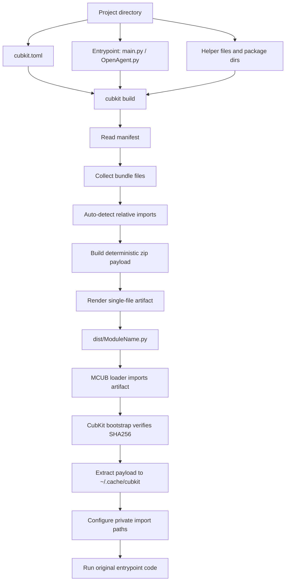

# CubKit documentation

CubKit packs a multi-file MCUB module project into one MCUB-loadable `.py`
artifact. You write normal source files, CubKit embeds helper files into the
generated artifact, and the generated bootstrap extracts them into a private cache
at import time.

## Full build flow



## Minimal project

```text
my_module/
  cubkit.toml
  src/
    main.py
    utils.py
```

`cubkit.toml` can be tiny:

```toml
format = 2

[module]
id = "my_module"

[bundle]
source = "src"
entrypoint = "main.py"
output = "dist/my_module.py"
```

When `source = "src"` is set, code paths (`entrypoint`, `packages`, `sources`) are
resolved inside `src/`. This keeps build config in the project root while module
code lives in `src/`.
When `output` is set, `cubkit build` writes there by default. CLI `-o/--output`
overrides the manifest output.

Assets and locale directories are always resolved from the project root, not
from `src`.

Optional metadata:

```toml
[module]
name = "MyModule"
version = "dev"
author = "@username"
description = "Example MCUB module"
requires = ["aiohttp"]
scope = "inline"

[bundle]
sign = true
```

## Manifest versions and migration

Format 2 separates module metadata from build layout. Legacy flat manifests are
still accepted, but new projects use `format = 2`. Do not mix root-level legacy
fields with `[module]` or `[bundle]`; CubKit rejects ambiguous manifests.

Migrate an existing project with:

```bash
cubkit migrate .
```

The original is saved as `cubkit.toml.bak`, then the converted manifest is
validated before the command succeeds. Running the command on format 2 is a
no-op.

## What to write in the main file

### Class-style module

Use class-style for most MCUB modules:

```python
from __future__ import annotations

import core.lib.loader.module_base as loader

from .utils import echo_text


class MyModule(loader.ModuleBase):
    name = "MyModule"
    version = "1.0.0"
    author = "@username"
    description = "Small CubKit example"

    @loader.command("echo")
    async def cmd_echo(self, message) -> None:
        await echo_text(message)
```

Notes:

- `name = "MyModule"` controls the generated filename and MCUB module name.
- `from .utils import ...` is private to this module artifact.
- `from __future__ import annotations` is allowed; CubKit moves it before the
  generated bootstrap automatically.

### Function-style module

Function-style also works. CubKit will add `# name:` from `cubkit.toml`/`id` if
needed:

```python
from __future__ import annotations

from .utils import echo_text


def register(kernel):
    @kernel.command("echo")
    async def echo_cmd(message):
        await echo_text(message)
```

## What to write in libs

Keep helper files free from MCUB registration side effects. Good helper modules
export functions/classes used by the main file.

`utils.py`:

```python
from __future__ import annotations

import utils as mcub_utils
import core.lib.types as typ


async def echo_text(message: typ.Event) -> typ.Event:
    text = mcub_utils.get_args_raw(message)
    await mcub_utils.answer(message, text or "empty")
    return message
```

Then import it privately:

```python
from .utils import echo_text
```

Do **not** use global package names for your own code:

```python
# Bad: can collide with MCUB/global modules
from utils import echo_text
from lib.utils import echo_text

# Good: private CubKit relative import
from .utils import echo_text
```

## Package directories

For larger modules, put helpers into one or more package directories:

```text
my_module/
  cubkit.toml
  src/
    main.py
    my_module_lib/
      __init__.py
      client.py
    shared_helpers/
      format.py
```

```toml
[module]
id = "my_module"

[bundle]
source = "src"
entrypoint = "main.py"
packages = ["my_module_lib", "shared_helpers"]
```

In `main.py`:

```python
from .client import ApiClient
from .format import pretty_text
```

CubKit adds all package directories to the generated module's private import
search path.

## Runtime environment, assets and localization

CubKit keeps the MCUB-compatible single `.py` output, but the generated artifact
contains a structured, isolated environment for its bundled files. Import it
relative to the module:

```python
from cubkit import (
    assets,
    get_environment,
    load_strings,
    metadata,
    resource,
    root,
)
```

The generated bootstrap publishes these values before the entrypoint runs. Use
direct imports as shown above so each loaded module keeps its own runtime values.

### Assets

Declare the directory in `cubkit.toml`:

```toml
[bundle]
assets = "assets"
```

Then access files without constructing cache paths:

```python
icon_path = assets.get("icon.png")
icon_bytes = assets.read_bytes("icon.png")
template = assets.read_text("templates/message.html")
config = assets.read_json("defaults.json")

# Alias for assets.get(...)
same_icon_path = resource("icon.png")
```

Available operations:

- `assets.root`: extracted assets directory or `None`;
- `assets.available` and `bool(assets)`: whether the module has assets;
- `assets.get(path)`: existing file/directory as `pathlib.Path`;
- `assets.exists(path)`: safe existence check;
- `assets.read_bytes`, `read_text`, and `read_json`.

Asset lookup resolves symlinks and rejects `..` or any other path which escapes
the configured directory.

### Metadata and environment

`metadata` is a read-only mapping with the effective `id`, `name`, `version`,
`author`, `description`, `requires`, `banner_url`, and `scop`. Literal class/header
metadata used by the generated MCUB artifact is reflected here too.

`root` is the extracted private bundle directory. `get_environment()` returns a
read-only mapping containing `root`, `assets`, `locales`, and `metadata`. Prefer
the dedicated asset API for distributable resource paths; the bundle root is
mainly useful for diagnostics and advanced integrations.

### Localization

Configure a locale directory:

```toml
[bundle]
locales = "locales"
```

Each direct child is one locale and contains an ordinary string-keyed mapping.
The filename stem must be a lowercase two- or three-letter MCUB language code
such as `en`, `ru`, or `uk`. Regional names (`en-US`, `ru-RU`) and uppercase
codes are rejected instead of being silently normalized. YAML/YML, JSON, and
TOML are supported:

```text
locales/
  en.yaml
  ru.yaml
  uk.yaml
```

`locales/en.yaml`:

```yaml
help: "Help for {name}"
done: "Done"
errors:
  unavailable: "Service is unavailable"
```

`locales/ru.yaml`:

```yaml
help: "Помощь для {name}"
done: "Готово"
errors:
  unavailable: "Сервис недоступен"
```

Use `load_strings` as the native `ModuleBase.strings` class attribute:

```python
from core.lib.loader.module_base import ModuleBase
from cubkit import load_strings


class Mod(ModuleBase):
    strings = load_strings()

    async def show_help(self, event) -> None:
        await event.edit(self.strings("help", name=self.name))
```

`load_strings()` returns a fresh regular dictionary on every call:

```python
{
    "en": {"help": "Help for {name}", "done": "Done", ...},
    "ru": {"help": "Помощь для {name}", "done": "Готово", ...},
}
```

There is no CubKit translation object and no separate locale selection. After
MCUB constructs the module, its native `utils.strings.Strings` handles
`self.strings(...)`, nested groups, the configured language, and the English
fallback exactly like an inline class dictionary.

`cubkit check` and `cubkit build` validate locale syntax and require every leaf
value to be a string. Files with unsupported extensions are bundled as ordinary
files but are not returned by `load_strings()`.

## Vendored libraries

Use `libs` when a module needs a local library that you do not want to publish to
PyPI or GitHub. CubKit embeds the library into the generated artifact and exposes
it under `cubkit.lib`.

Example layout:

```text
my_module/
  cubkit.toml
  main.py
  vendor/
    genipng/
      pyproject.toml
      src/
        genipng/
          __init__.py
```

`cubkit.toml`:

```toml
format = 2

[module]
id = "my_module"

[bundle]
entrypoint = "main.py"

[libs.genipng]
type = "local"
path = "vendor/genipng"
```

`path` can point to a directory inside the project, outside it with `../`, or to
an absolute local path:

```toml
[libs.tabfix]
type = "local"
path = "/home/user/test/tabfix"
```

`main.py`:

```python
from cubkit.lib import genipng


def make_image() -> bytes:
    return genipng.render_png()
```

Supported local library shapes:

```text
vendor/genipng/genipng/__init__.py
vendor/genipng/src/genipng/__init__.py
vendor/genipng/genipng.py
vendor/genipng/__init__.py
vendor/genipng-0.1-py3-none-any.whl
vendor/genipng.cpython-314-aarch64-linux-android.so
```

Wheels are unpacked into the vendored library namespace. Native extension files
are embedded too, but they must already match the target platform and Python ABI
where MCUB runs. When `libs` are present, `cubkit build` prints:

```text
collecting dependencies...
```

If a local directory has `pyproject.toml`, `setup.py`, or `setup.cfg`, CubKit
installs it with pip instead of copying only its files. That means dependencies
declared by the local package are installed into the same vendored payload too.

Pip/GitHub/URL descriptors are resolved with `pip install --target` during build:

```toml
[libs.some_lib]
url = "https://example.com/some_lib.whl"

[libs.other_lib]
package_pip = "other-lib>=1.0"

[libs.github_lib]
package_github = "https://github.com/example/some-lib"
```

For GitHub URLs, CubKit passes `git+https://github.com/...` to pip unless you
already provided a `git+` URL. Network-based descriptors require network access
at build time.

### Do not vendor MCUB's own dependencies by default

If you want a module without extra external dependencies, do **not** put MCUB's
runtime dependencies into `[libs]`. MCUB already ships/uses them, so bundling
another copy usually only makes the artifact larger and can create version
conflicts.

Usually do **not** vendor these packages:

```text
telethon-MCUB==1.44.1
psutil
aiohttp
pysocks
python-socks[asyncio]
aiosqlite
cryptg
socks
jinja2
aiohttp-jinja2
PyYAML
```

Import and use them normally from the MCUB environment. Vendor them only for a
special reason, for example when you need a private patched build or a strict
version isolated from the framework.

## Full module example

This example shows a class-style MCUB module with:

- localized `strings`;
- `ModuleConfig` and a custom validator;
- a helper function in a bundled package;
- private CubKit imports.

Project layout:

```text
cubkit_full_example/
  cubkit.toml
  src/
    main.py
    test_module/
      __init__.py
      event.py
      custom_validator.py
```

`cubkit.toml`:

```toml
format = 2

[module]
id = "cubkit_full_example"

[bundle]
source = "src"
entrypoint = "main.py"
# output = "dist/cubkit-full-example.py"
packages = ["test_module"]
sign = true
```

`main.py`:

```python
from __future__ import annotations

from core.lib.loader.module_base import ModuleBase, command
from core.lib.loader.module_config import ModuleConfig, ConfigValue
import utils

from test_module.event import edit_with_html
from test_module.custom_validator import HexColor


class CubKitTestModule(ModuleBase):
    name = "cubkit-full-example"

    strings: utils.Strings | dict = {
        "ru": {"key_test": "Тест ключ"},
        "en": {"key_test": "Test key"},
    }

    config = ModuleConfig(
        ConfigValue(
            "key_test",
            "#000000",
            description=lambda mod: mod.strings("key_test"),
            validator=HexColor(),
        )
    )

    @command("test")
    async def cmd_test(self, event) -> None:
        value = self.config.get("key_test", "#000000")
        await edit_with_html(event, f"<b>key:</b> {value}")
```

The full example uses absolute imports from the bundled package name
(`test_module...`) because they are clearer for IDEs and raw source reading.
CubKit still embeds `test_module/` into the final artifact. Private relative
imports like `from .event import ...` also work after build, but are more
CubKit-specific.

`test_module/__init__.py`:

```python
from __future__ import annotations

from .custom_validator import HexColor
from .event import edit_with_html

__all__ = ["HexColor", "edit_with_html"]
```

`test_module/event.py`:

```python
from __future__ import annotations

from core.lib.types import Event


async def edit_with_html(call: Event, text: str) -> Event | None:
    try:
        event = await call.edit(text, parse_mode="html")
    except Exception:
        return None
    return event


__all__ = ["edit_with_html"]
```

`test_module/custom_validator.py`:

```python
from __future__ import annotations

import re
from typing import Any

from core.lib.loader.module_config import ValidationError, Validator


class HexColor(Validator):
    internal_id = "HexColor"
    _pattern = re.compile(r"^#[0-9a-fA-F]{6}$")

    def validate(self, value: Any) -> str:
        if not isinstance(value, str):
            raise ValidationError("Expected hex color string")

        value = value.strip()
        if not self._pattern.fullmatch(value):
            raise ValidationError("Expected color like #ff8800")

        return value.lower()


__all__ = ["HexColor"]
```

Build it:

```bash
cubkit check .
cubkit build .
```

The final artifact will be `dist/cubkit-full-example.py` because the class
attribute `name = "cubkit-full-example"` is used as the MCUB module name.

## Signature and debug comments

With:

```toml
[bundle]
sign = true
```

CubKit adds deterministic integrity comments:

```python
# CubKit source sha256: ...
# CubKit payload sha256: ...
# CubKit signature: ...
```

Every generated artifact also contains a source map/debug block:

```python
# CubKit source map:
# - generated line 120 -> main.py:1
# - bundled files are extracted from the CubKit payload at import time:
#   - utils.py -> utils.py:1 (lines: 10, sha256: ...)
```

This is for debugging generated tracebacks and verifying what was embedded.

## Best practices

### Use relative imports for your own code

Prefer:

```python
from .utils import helper
```

This prevents accidental import of MCUB/global modules named `utils`, `lib`, or
similar common names.

### Keep the main file focused

Put MCUB registration, commands and lifecycle hooks in the entrypoint. Move pure
logic, API clients, formatting and parsing to helper files.

### Avoid import-time network or heavy work

Module imports happen inside MCUB loader. Do not start requests, long tasks, or
filesystem-heavy scans at import time. Do that inside commands/lifecycle methods.

### Keep metadata in one place

For class-style modules, prefer class attributes:

```python
class MyModule(loader.ModuleBase):
    name = "MyModule"
    version = "1.0.0"
```

CubKit will align generated `# name:` with the class name.

### Use unique names

Use a stable module name and avoid case-only rename churn. MCUB may use module
names as filenames in `modules_loaded/`.

### Use `sign = true` for release artifacts

It is not cryptographic author identity, but it gives a deterministic source and
payload fingerprint in the generated artifact.

### Check before sending

```bash
cubkit check .
cubkit build .
python -m py_compile dist/MyModule.py
```

## Common commands

```bash
cubkit init my_module
cubkit types my_module
cubkit check my_module
cubkit build my_module
```

`cubkit build` prints progress with processed files and writes the final artifact
to `dist/<module-name>.py`.

`cubkit types` downloads MCUB type helper files from
`hairpin01/MCUB-fork/core/lib/types/*.py` into local `core/lib/types/` and adds
`core/` to `.gitignore`. This is for IDE/type-checking convenience; the generated
module artifact does not need those files bundled.
